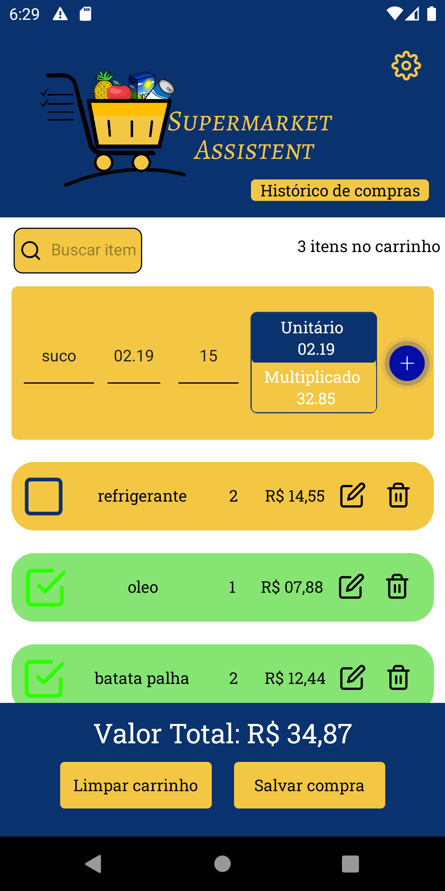
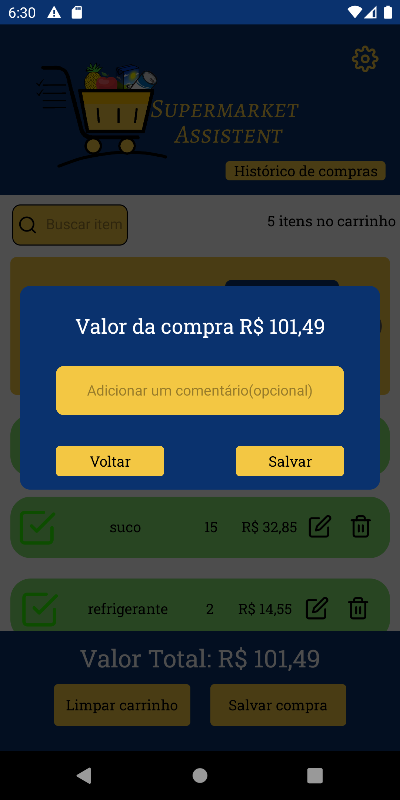
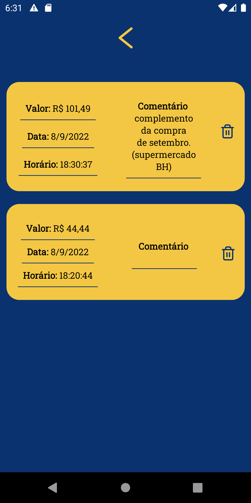

<p align="center">
  <a rel="noopener" target="_blank"></a>
</p>

**SupermarketAssistent**  everything you need for good control when shopping.

<p align="center">
  <a rel="noopener" target="_blank"></a>
   <a rel="noopener" target="_blank"></a>
    <a rel="noopener" target="_blank"></a>
     <a rel="noopener" target="_blank"></a>
     <a rel="noopener" target="_blank"></a>
</p>

## Getting started

```sh
// use yarn to install dependencies
yarn

// to run the server
yarn start 

// to install the app
yarn android
```

# About

here you can organize your shopping list, have the sum of the total amount. and at the end of the purchase, you can store everything in the history so you don't miss anything!
